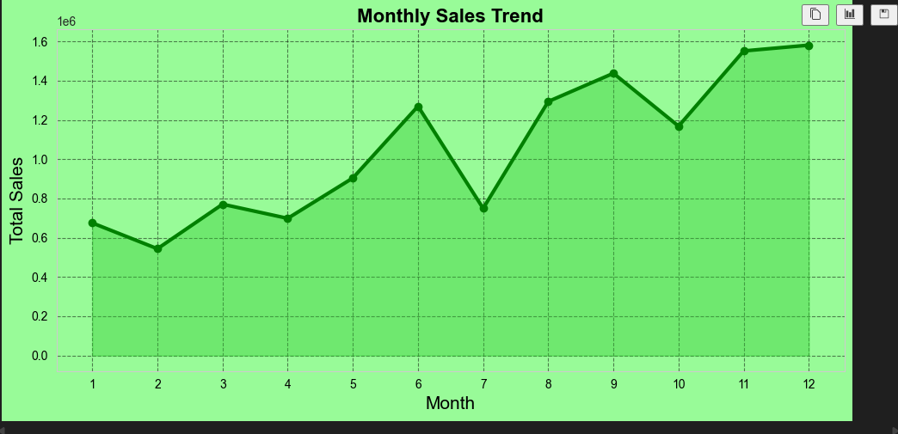
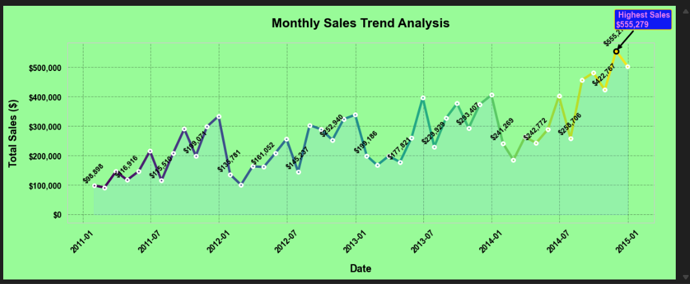
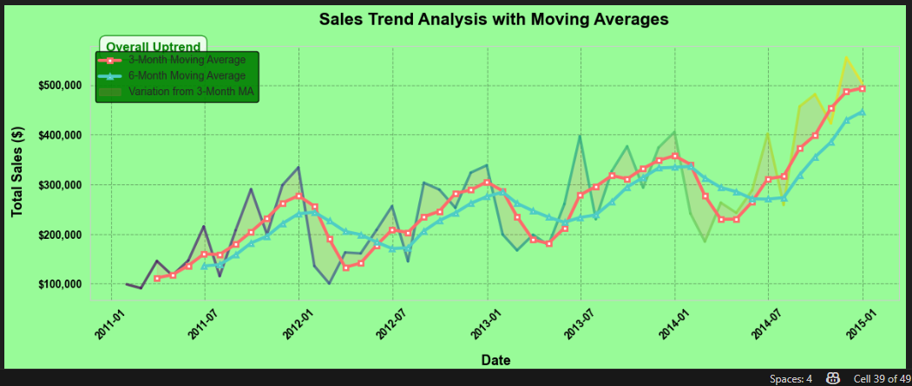
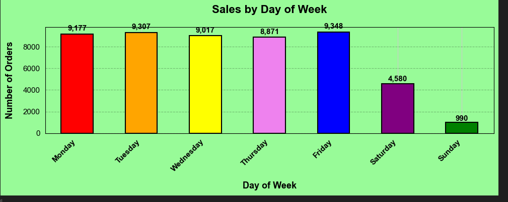
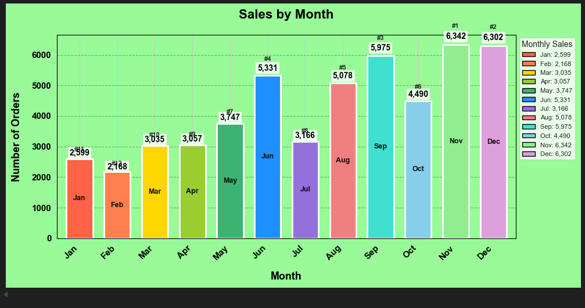
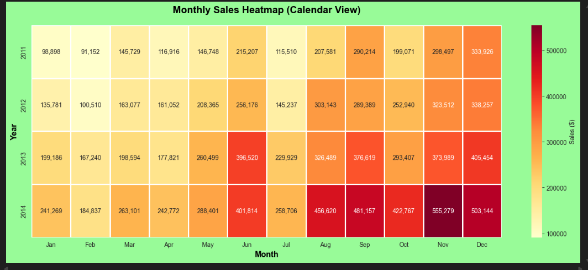
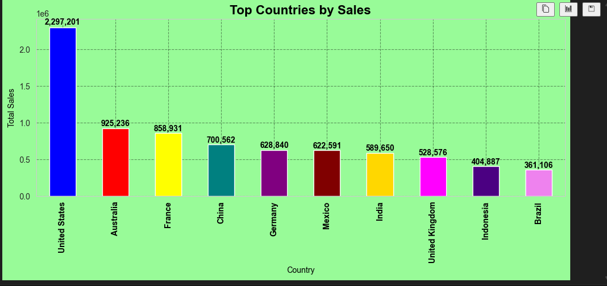
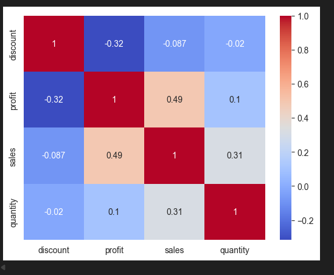

# Superstore Sales Analysis

A comprehensive analysis of Superstore sales data (2011-2014) to uncover actionable business insights for marketing optimization, inventory management, and profitability improvement.

## Project Overview

This project analyzes 9,994 transactions to answer key business questions:
- When is the best time to advertise (which months/days)?
- Which products and categories drive the most profit?
- Which customer segments are most valuable?
- What are the sales trends and seasonal patterns?
- How do discounts impact profitability?

## Dataset Description

The dataset contains **9,994 transactions** from **2011 to 2014** with the following 21 columns:

| Column Name | Description | Data Type |
|-------------|-------------|-----------|
| `order_id` | Unique identifier for each order | String |
| `order_date` | Date the order was placed | Date |
| `ship_date` | Date the order was shipped | Date |
| `ship_mode` | Shipping method (Standard Class, Second Class, etc.) | String |
| `customer_name` | Name of the customer | String |
| `segment` | Customer segment (Consumer, Corporate, Home Office) | String |
| `state` | State where the order was delivered | String |
| `country` | Country where the order was delivered | String |
| `market` | Market region (APAC, EU, Africa, etc.) | String |
| `region` | Geographic region | String |
| `product_id` | Unique identifier for each product | String |
| `category` | Product category (Technology, Office Supplies, Furniture) | String |
| `sub_category` | Product sub-category (Phones, Chairs, Storage, etc.) | String |
| `product_name` | Name of the product | String |
| `sales` | Total sales amount for the line item | Float |
| `quantity` | Number of units sold | Integer |
| `discount` | Discount applied to the line item | Float |
| `profit` | Profit generated from the line item | Float |
| `shipping_cost` | Cost of shipping | Float |
| `order_priority` | Priority level of the order (High, Medium, Low) | String |
| `year` | Year of the order | Integer |

## Data Cleaning Process

Before analysis, the following data cleaning steps were performed:

| Step | Action | Purpose |
|------|--------|---------|
| 1 | **Checked for missing values** | Verified no null values exist in any column using `df.isnull().sum()` |
| 2 | **Validated data types** | Reviewed data types of all columns to ensure correct format |
| 3 | **Converted date columns** | Transformed `order_date` from object type to datetime format using `pd.to_datetime()` |

**Missing Values Summary:**
All 21 columns have 0 missing values ✓

text

**Data Types After Cleaning:**

| Column | Data Type |
|--------|-----------|
| `order_id` | string |
| `order_date` | datetime64 |
| `ship_date` | datetime64 |
| `sales`, `discount`, `profit`, `shipping_cost` | float64 |
| `quantity`, `year` | int64 |
| All other columns | string (object) |

## Feature Engineering

To enable deeper temporal analysis, new features were created:

| New Feature | Method | Purpose |
|-------------|--------|---------|
| `Month` | `df['order_date'].dt.month` | Extract numeric month (1-12) for monthly sales aggregation |
| `Day` | `df['order_date'].dt.day_name()` | Extract day name (Monday-Sunday) for day-of-week sales analysis |
| `profit_margin` | `(df['profit'] / df['sales']) * 100` | Calculate profit percentage for segment profitability comparison |

## Exploratory Data Analysis (EDA)

The analysis addressed the following business questions:

### Q1: Sales per Month
- **Visualization:** Line chart with area fill
- **Finding:** Sales peak in November/December, lowest in January/February
- **Insight:** Holiday shopping season drives year-end sales surge

### Q2: Top Selling Products
- **Visualization:** Table of top 10 products by sales
- **Finding:** Smartphones dominate the top 10 best-selling products
- **Top Product:** Apple Smart Phone, Full Size ($86,935.78)

### Q3: Sales by Country
- **Visualization:** Horizontal bar chart
- **Finding:** United States generates significantly more sales than any other country
- **Insight:** Geographic concentration presents both opportunity and risk

### Q4: Best Period to Advertise
- **Visualizations:** 
  - Bar chart for sales by day of week
  - Bar chart for sales by month
- **Findings:** 
  - Friday is the busiest shopping day (9,348 orders)
  - November and September have highest sales volumes

### Q5: Profit Analysis by Category
- **Finding:** Technology category leads with $663,778.73 profit
- **Ranking:** Technology > Office Supplies > Furniture

### Q6: Loss-Making Products
- **Finding:** Top 10 loss-making products identified
- **Worst Performer:** Cubify CubeX 3D Printer Double Head Print (-$9,239.97)

### Q7: Profit Margin by Segment
- **Finding:** Home Office segment has highest average profit margin (5.29%)
- **Ranking:** Home Office > Consumer > Corporate

## Correlation Analysis

### Q8: Correlation Between Discount and Profit
- **Method:** Pearson correlation matrix using `df.corr()`
- **Visualization:** Heatmap with annotations
- **Finding:** Discount and profit have a **negative correlation of -0.44**
- **Interpretation:** Higher discounts consistently lead to lower profits

## Time Series Forecasting

### Monthly Sales Trend Analysis
- **Methods:** 
  - 3-month moving average (smooths short-term fluctuations)
  - 6-month moving average (reveals longer-term trends)
- **Visualizations:**
  - Line chart with gradient colors
  - Bar chart with value labels
  - Calendar-style heatmap
- **Finding:** Overall trend is positive despite monthly volatility

## Key Findings Summary

| Finding | Value | Business Implication |
|---------|-------|---------------------|
| Best months to advertise | November & December | Allocate 40% of Q4 budget to these months |
| Best day to advertise | Friday (9,348 orders) | Run Friday-specific promotions & email campaigns |
| Top product category | Technology ($663K profit) | Expand tech inventory, negotiate better supplier terms |
| Most profitable segment | Home Office (5.29% margin) | Target remote workers with premium products |
| Top country by sales | United States | Focus marketing efforts, consider localization |
| Sales growth trend | Positive | Maintain growth trajectory with strategic investments |
| Discount-profit correlation | -0.44 | Re-evaluate discounting strategy |

## Visualizations

### 1. Monthly Sales Trend
*Overall sales trend showing seasonal patterns and growth trajectory*

### 2. Monthly Sales Trend Analysis
*Detailed breakdown of sales fluctuations month by month*

### 3. Sales Trend Analysis with Moving Averages
*3-month and 6-month moving averages to smooth out volatility*

### 4. Sales by Day of Week
*Friday is the busiest day, Sunday is the slowest*

### 5. Sales by Month
*September, November, and December show highest sales volumes*

### 6. Monthly Sales Performance for Every Year
*Year-over-year comparison of monthly performance*

### 7. Monthly Sales Heatmap (Calendar View)
*Calendar-style visualization showing sales intensity across months and years*

### 8. Top Countries by Sales
*United States leads all other markets significantly*

### 9. Correlation Analysis: Discount vs. Profit
*Negative correlation (-0.44) confirms discounts erode profitability*

## Actionable Recommendations

### Marketing & Promotions (When to Spend)
- Launch holiday campaigns in **September** (not November)
- Create **"Friday Flash Sales"** for weekly engagement
- Run **"February Flash Sale"** to boost slow periods

### Inventory & Product Strategy (What to Sell)
- Aggressively stock **Technology category** and smartphones by mid-September
- **Re-evaluate loss-making products** (Cubify CubeX 3D Printer, select smartphones)
- **Bundle** slow movers with top-selling smartphones

### Pricing & Discount Strategy (How to Price)
- **Limit discounts to 15-20%** for most products (correlation: -0.44)
- Run **A/B tests** to find profit-maximizing discount levels
- Shift **Home Office segment** messaging from price to value

### Customer Targeting (Who to Focus On)
- Launch **"Home Office Pro"** loyalty program
- Develop **"Corporate Perks"** for bulk-order efficiency

## Technologies Used

| Category | Tools |
|----------|-------|
| Data Processing | Python, Pandas, NumPy |
| Visualization | Matplotlib, Seaborn |
| Analysis | Statistical analysis, Time series, Correlation |
| Environment | Jupyter Notebook |

## Conclusion

The Superstore should pivot from a broad, discount-driven sales strategy to a focused, value-driven profitability strategy. By aligning marketing, inventory, and pricing decisions with seasonal patterns and customer-segment insights, the business can protect margins and sustain growth.

**The most impactful insight** is the strong negative correlation between discounts and profits (-0.44). This challenges the notion that aggressive price reductions are a reliable growth strategy and instead points to the need for a more disciplined, value-based pricing model.

## Author

GEORGE ONYANGO OCHIENG
primary email: georgebabji1220@gmail.com
alternative email: georgeonyango1220@gmail.com
whatsapp: https://wa.me/254111866769
call: +2540115136359
linkedln: https://www.linkedin.com/in/george-onyango-5a5906360/
upwork: https://www.upwork.com/freelancers/~01ea729f5447c9e73b
